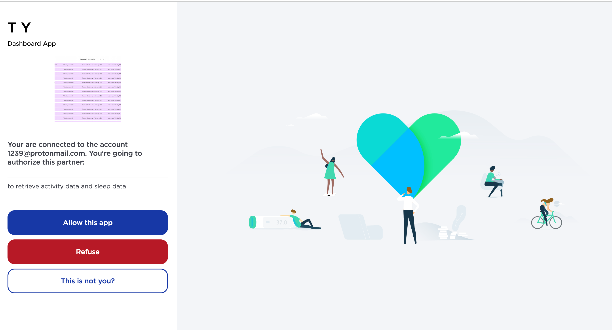

# How to access your Withings workout data

1. Install the relevant packages with `pip install -r requirements.txt`
2. Run `python auth.py` and click to 'Allow this app' in the browser popup page to get your authentication token. This page can load slowly
As of mid 2023, the browser page looks like this: 
3. Get your auth code from the callback url in the browser. As of mid 2023, your auth code is between `code=` and `&state`. Your callback url can have a different domain to mine.

4.  Enter your auth code into the terminal as prompted. You should see a message saying 'Authentication successful' and your access token and refresh token. The script automatically adds them to a local .env file for you.

4. Run `python workouts.py` to get your workout data.

## Troubleshooting

### Q. I am successfully authenticating and fetching, but there is no data. Why?
A. Check that you have connected to the correct developer account that is linked to your Withings account and devices.
I've had issues where I accidentally setup a different development account. I was connecting to this account, which contained none of my data.
